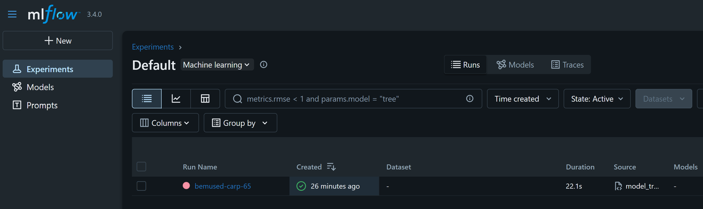
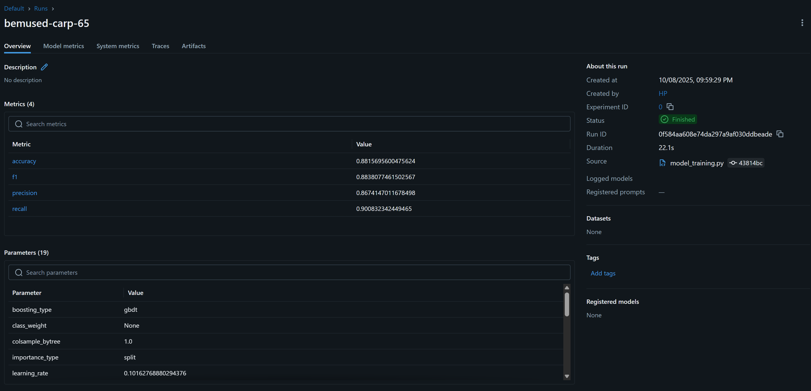

# 🤖 **Model Training — MLOps Hotel Reservation Prediction**

This branch turns the **preprocessed datasets** into a **trained, versioned model** with experiment tracking via **MLflow**.
Crucially, this stage was made **much easier** thanks to the insights and validated transformations from the earlier **notebook experimentation** stage.

The goal here is to **train, tune, evaluate, and persist** a LightGBM classifier in a **reproducible, configurable** way—ready for downstream inference and deployment.

## 🧾 **What’s New in This Stage**

* 🆕 **`src/model_training.py`** — end-to-end training pipeline (load → tune → evaluate → save → log to MLflow).
* 🆕 **`config/model_params.py`** — tidy LightGBM search space and `RandomizedSearchCV` settings.
* 🔧 **`config/paths_config.py`** — extended with `MODELS_DIR` and `MODEL_OUTPUT_PATH`.
* 🖼️ **Images for docs:** `img/model_training/mlflow_experiment.png`, `img/model_training/mlflow_run.png`.
* 📦 **New output folder:** `artifacts/models/` — contains the saved model `lgbm_model.pkl`.

## 🧩 **Key Functionalities**

The training pipeline provides:

1. **Data loading & split** — expects `processed_train.csv` and `processed_test.csv` (from the previous stage).
2. **Hyperparameter search** — `RandomizedSearchCV` over a **LightGBM** search space.
3. **Evaluation** — Accuracy, Precision, Recall, and F1 reported on the held-out test set.
4. **Model persistence** — stores the best estimator at `artifacts/models/lgbm_model.pkl`.
5. **Experiment tracking** — datasets, params, metrics, and model artefacts logged to **MLflow**.

## 🧠 **How to Run**

### 1) Train the model

```bash
python src/model_training.py
```

### 2) View experiments in MLflow

```bash
mlflow ui --host 127.0.0.1 --port 5555
```

Then open: [http://127.0.0.1:5555](http://127.0.0.1:5555)

<p align="center">
  
</p>

<p align="center">
  
</p>

## 🗂️ **Updated Project Structure**

Only additions/updates from the previous stage are shown with markers.

```
mlops-hotel-reservation-prediction/
├── artifacts/
│   ├── processed/
│   │   ├── processed_train.csv
│   │   └── processed_test.csv
│   └── models/                         # 🆕 model artefacts
│       └── lgbm_model.pkl
├── config/
│   ├── config.yaml
│   ├── paths_config.py                 # 🔧 added MODEL_OUTPUT_PATH / models dir
│   └── model_params.py                 # 🆕 LightGBM + RandomizedSearch params
├── img/
│   └── model_training/                 # 🆕 documentation images
│       ├── mlflow_experiment.png
│       └── mlflow_run.png
├── src/
│   ├── data_preprocessing.py
│   ├── model_training.py               # 🆕 training pipeline
│   ├── logger.py
│   ├── custom_exception.py
│   └── __init__.py
├── utils/
│   └── common_functions.py
├── notebooks/
│   └── notebook.ipynb
├── requirements.txt
├── setup.py
└── README.md                           # 📖 you are here
```

## 🔍 **Pipeline Highlights**

* **Config-driven:** model search space and CV settings live in `config/model_params.py`.
* **Consistent paths:** all inputs/outputs resolved via `config/paths_config.py`.
* **Reproducible runs:** MLflow captures **datasets**, **parameters**, **metrics**, and the **model artefact**.
* **Balanced training data:** assumes the prior stage produced balanced, feature-selected datasets.


## 🚀 **What’s Next — Training Pipeline Automation**

The next branch will focus on **building a modular training pipeline**, integrating the model training process into a repeatable, automated workflow.
This stage will introduce **structured pipeline orchestration**, enabling scheduled retraining, experiment reproducibility, and seamless handoff into CI/CD systems.

It will combine the preprocessing and model training components into a unified, end-to-end pipeline — the foundation for scalable **MLOps automation**.