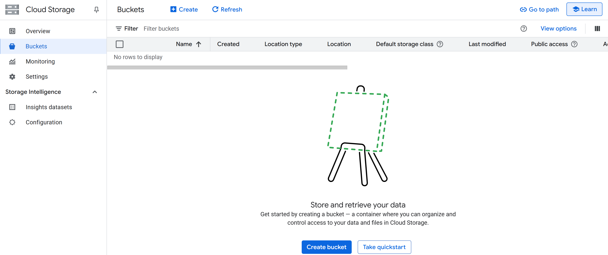
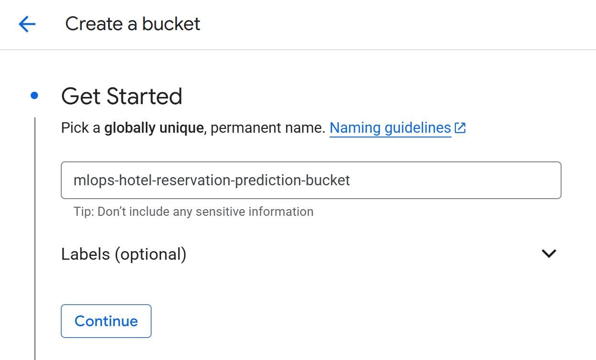
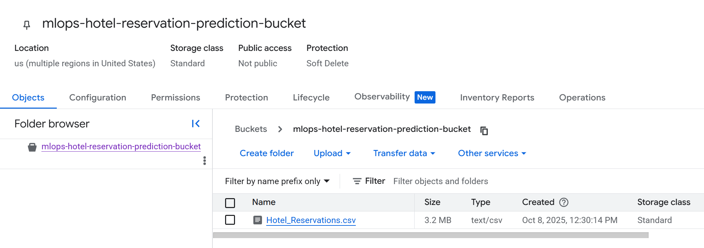
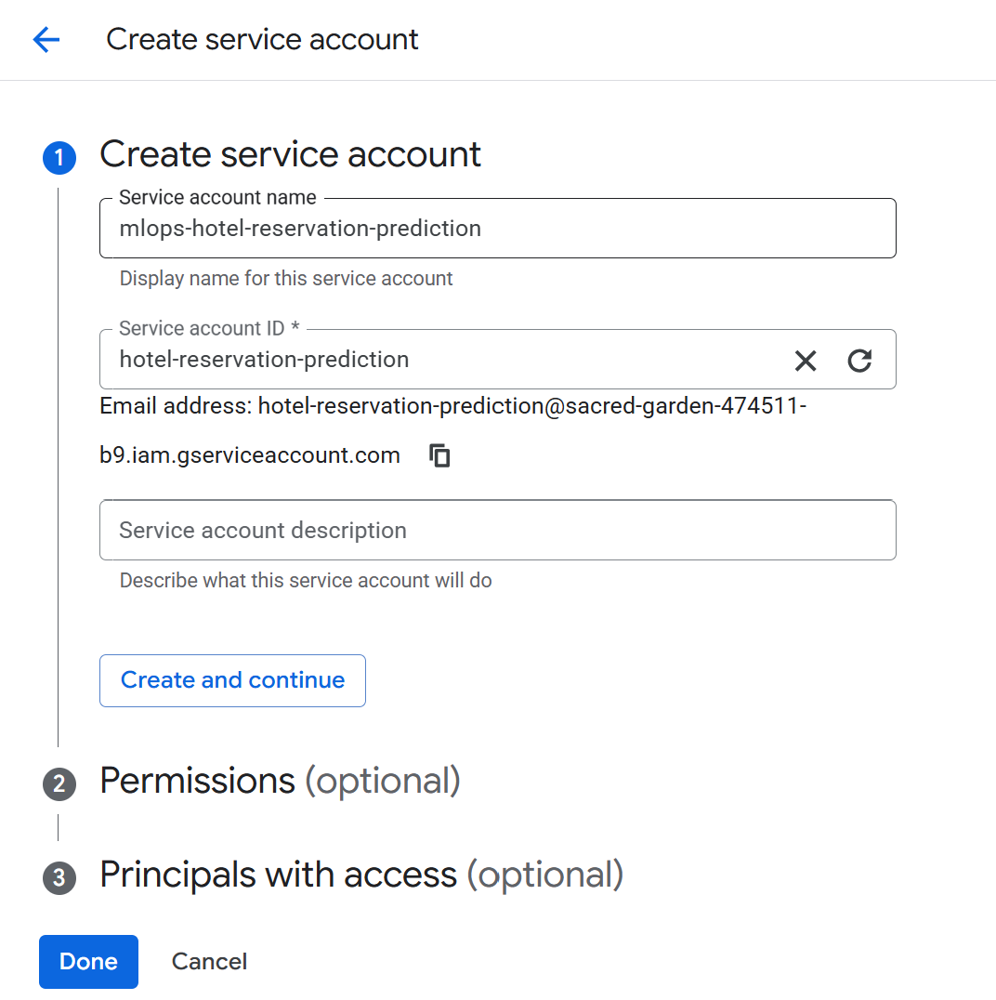
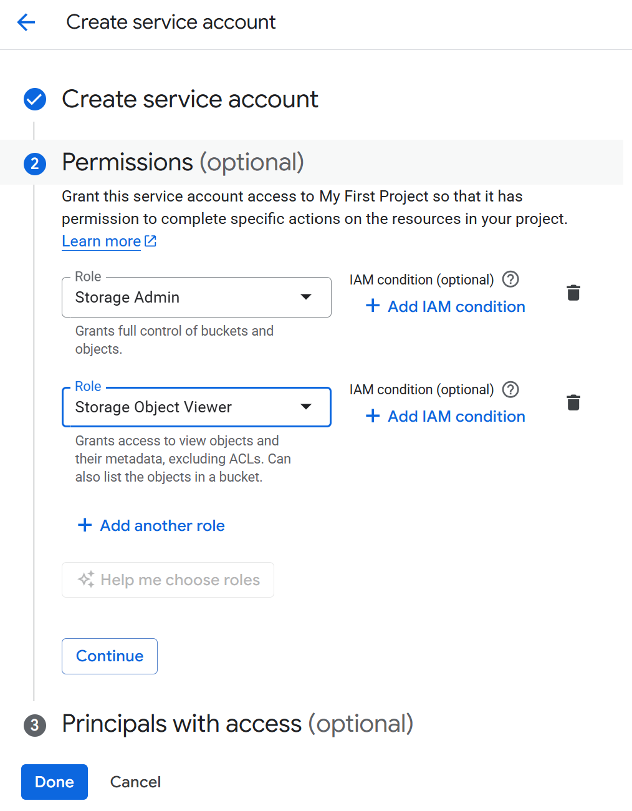
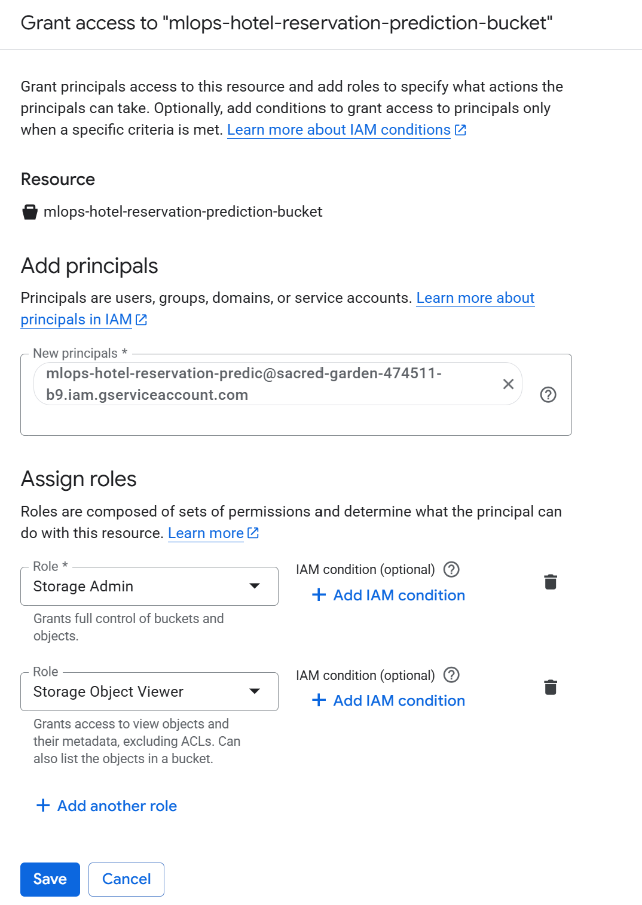
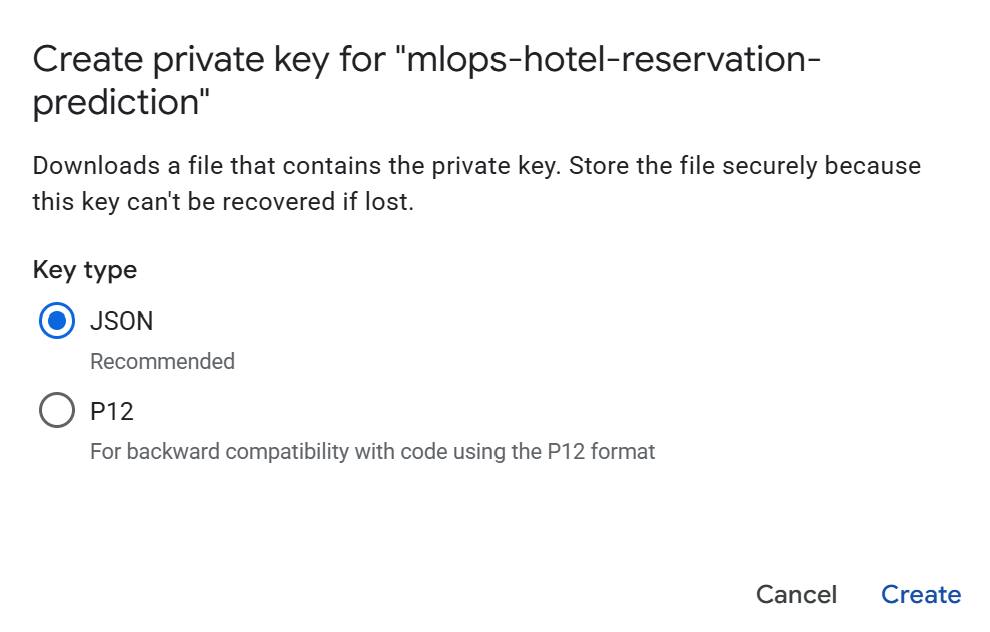

# 🚚 **Data Ingestion from GCP — MLOps Hotel Reservation Prediction**

This branch adds a **fully scripted data ingestion stage** that pulls the Hotel Reservations dataset from **Google Cloud Storage (GCS)**, writes a local **raw extract**, and produces **train/test splits** for downstream processing.

**What this stage includes**

* ✅ GCP bucket setup & service account authentication
* ✅ Local configuration files (`config.yaml`, `paths_config.py`)
* ✅ Ingestion script (`src/data_ingestion.py`) to **download → split → save**
* ✅ Clear, reproducible instructions (Windows-friendly) with screenshots


## 🗂️ **Updated Project Structure**

```
mlops-hotel-reservation-prediction/
├── artifacts/                                      # 📦 rtefacts and outputs
│   └── raw/                                        #   Created at runtime by data ingestion
│       ├── raw.csv                                 #   Downloaded dataset (after run)
│       ├── train.csv                               #   Train split (after run)
│       └── test.csv                                #   Test split (after run)
├── config/                                         
│   ├── __init__.py
│   ├── config.yaml                                 #   NEW: data ingestion params (bucket, file, ratio)
│   └── paths_config.py                             #   NEW: central path constants
├── img/
│   └── data_ingestion/                             # 🖼️ Screens for this README (order used below)
│       ├── create_gcp_bucket.png
│       ├── name_bucket.png
│       ├── deselect_public_access_prevention.img
│       ├── upload_data.png
│       ├── create_service_account.png
│       ├── service_account_permissions.png
│       ├── add_principal.png
│       └── create_key.png
├── notebook/                                       
├── pipeline/
├── src/                                            
│   ├── __init__.py
│   ├── custom_exception.py                         #   Detailed, consistent error handling
│   ├── logger.py                                   #   Centralised daily logging
│   └── data_ingestion.py                           #   NEW: GCS download & train/test split
├── static/                                         
│   └── README.md
├── templates/                                      
│   └── README.md
├── utils/                                          
│   ├── __init__.py
│   └── common_functions.py                         #   YAML reader
├── MLOps_Hotel_Reservation_Prediction.egg-info/    
├── .gitignore                                      
├── README.md                                       # 📖 You are here
├── requirements.txt                                
├── setup.py                                        
└── venv/                                           
```

> 💡 **Note:** The `raw/` folder and CSVs are created when you run the ingestion script.


## 📦 **Dataset**

**Kaggle source:**
[https://www.kaggle.com/datasets/ahsan81/hotel-reservations-classification-dataset](https://www.kaggle.com/datasets/ahsan81/hotel-reservations-classification-dataset)

Download the CSV and **rename it** to remove the space:

```
Hotel_Reservations.csv
```

Sample columns (for context):

```
Booking_ID, no_of_adults, no_of_children, no_of_weekend_nights, no_of_week_nights,
type_of_meal_plan, required_car_parking_space, room_type_reserved, lead_time,
arrival_year, arrival_month, arrival_date, market_segment_type, repeated_guest,
no_of_previous_cancellations, no_of_previous_bookings_not_canceled,
avg_price_per_room, no_of_special_requests, booking_status
```


## ☁️ **Create a GCS Bucket & Upload the Dataset**

1. **Create a bucket**
   

2. **Name the bucket**
   

3. **Allow public access (disable prevention) — only if you explicitly need it**

> You will need to *deselect* public access prevention at this step if following the exact flow shown.
> 

4. **Upload the dataset** (`Hotel_Reservations.csv`) into your bucket
   


## 🔐 **Service Account & Permissions**

Install **Google Cloud CLI**: [https://cloud.google.com/sdk/docs/install](https://cloud.google.com/sdk/docs/install)
Restart VS Code, then verify:

```bash
gcloud --version
```

5. **Create a Service Account**
   

6. **Assign roles to the Service Account**
   

7. **Grant bucket access to the Service Account**
   From **Buckets → (⋮) Edit access → Add principal**, use your service account email, e.g.:

```
mlops-hotel-reservation-predic@sacred-garden-474511-b9.iam.gserviceaccount.com
```

Give it the **same roles** as above.


8. **Create and download a JSON key** for the Service Account
   

On Windows, right-click the downloaded file → **Copy as path**.

9. **Set the Application Default Credentials (ADC)** environment variable

**CMD (recommended):**

```bat
set "GOOGLE_APPLICATION_CREDENTIALS=C:\Path\To\your-key.json"
echo %GOOGLE_APPLICATION_CREDENTIALS%
```

**PowerShell:**

```powershell
$env:GOOGLE_APPLICATION_CREDENTIALS="C:\Path\To\your-key.json"
echo $env:GOOGLE_APPLICATION_CREDENTIALS
```

> ✅ This grants the VS Code terminal permission to access GCS via your service account.

*(Alternative: use user creds instead of a key)*

```bat
gcloud auth application-default login
```


## 🧩 **Local Configuration Files**

Create **`config/config.yaml`** (update the bucket name to yours):

```yaml
# -
# Configuration File — config/config.yaml
# -
# Stores project-level configuration parameters for each pipeline stage.
# -

data_ingestion:
  bucket_name: "mlops-hotel-reservation-prediction-bucket"
  bucket_file_name: "Hotel_Reservations.csv"
  train_ratio: 0.8
```

Create **`config/paths_config.py`**:

```python
from __future__ import annotations
import os

# -- DATA INGESTION --
RAW_DIR = "artifacts/raw"
RAW_FILE_PATH = os.path.join(RAW_DIR, "raw.csv")
TRAIN_FILE_PATH = os.path.join(RAW_DIR, "train.csv")
TEST_FILE_PATH  = os.path.join(RAW_DIR, "test.csv")

CONFIG_PATH = "config/config.yaml"

# -- DATA PROCESSING -
PROCESSED_DIR = "artifacts/processed"
PROCESSED_TRAIN_DATA_PATH = os.path.join(PROCESSED_DIR, "processed_train.csv")
PROCESSED_TEST_DATA_PATH  = os.path.join(PROCESSED_DIR, "processed_test.csv")

#  MODEL TRAINING -
MODEL_OUTPUT_PATH = "artifacts/models/lgbm_model.pkl"
```

> These constants are imported by the ingestion script and subsequent stages.


## 🧪 **Run the Ingestion Script**

With your **venv active** and **ADC set**:

```bash
python src/data_ingestion.py
```

**What it does**

1. Downloads `Hotel_Reservations.csv` from your GCS bucket → `artifacts/raw/raw.csv`
2. Splits into **train/test** using `train_ratio` → `artifacts/raw/train.csv`, `artifacts/raw/test.csv`
3. Logs progress to your central logger


## 🛠️ **Troubleshooting**

* **`DefaultCredentialsError: Your default credentials were not found`**
  Ensure the env var is set **without spaces** around `=` (CMD):

  ```bat
  set "GOOGLE_APPLICATION_CREDENTIALS=C:\Path\To\your-key.json"
  ```

  Or use:

  ```bat
  gcloud auth application-default login
  ```

* **`'src' is not recognised as a command`**
  Run the script with Python:

  ```bat
  python src\data_ingestion.py
  ```

* **403 / permission errors**
  Confirm bucket-level **principal** and **roles** match the service account.

* **404 object not found**
  Check you **renamed the dataset** to `Hotel_Reservations.csv` and uploaded to the correct bucket.

* **Wrong project context**

  ```bat
  gcloud config list
  gcloud config set project <YOUR_PROJECT_ID>
  ```


## 🚀 **What’s Next**

In the next branch, we’ll implement **Jupyter Notebook Testing** using the outputs from `artifacts/raw/`.