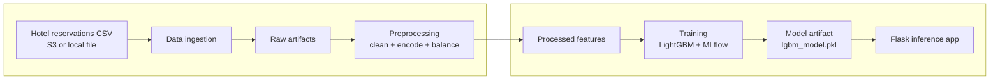
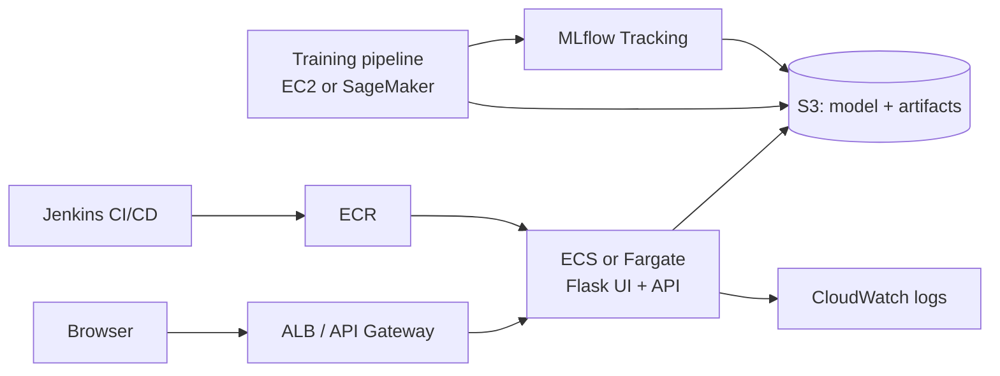

# MLOps Hotel Reservation Prediction (AWS-first)

End-to-end MLOps workflow for predicting hotel reservation cancellations, from ingestion to training and real-time inference.
Built to reduce revenue loss, improve guest retention, and provide a reproducible ML delivery path with AWS-friendly deployment targets.

<p align="center">
  
</p>

## Why this project

- Reduce late cancellations with early risk signals.
- Improve revenue planning with consistent, measurable model performance.
- Ship an inference UI/API quickly with container-ready deployments.

## MLOps Flow



## AWS Deployment Overview



## Quick Start

1) Install prerequisites:
   - Python 3.10+
   - Docker (optional, for container runs)
   - AWS CLI (optional, for cloud deploys)

2) Create a virtual environment and install dependencies:
```bash
python -m venv venv
# Windows
venv\Scripts\activate
# macOS/Linux
source venv/bin/activate

pip install -r requirements.txt
```

3) Configure the pipeline:
   - Update `config/config.yaml` for your data source and feature settings.
   - Review `config/paths_config.py` for artifact locations.

4) Run end-to-end training:
```bash
python pipeline/training_pipeline.py
```

5) Launch the inference app:
```bash
python app.py
# open http://localhost:8080
```

## Tech Stack

- Front end: HTML + CSS, Jinja2 templates.
- Back end: Flask (Python), model loading with joblib.
- ML: LightGBM, scikit-learn, SMOTE, MLflow tracking.
- MLOps: Docker, Jenkins CI/CD.
- AWS services (deployment targets): S3, ECR, ECS/Fargate, CloudWatch, IAM/Secrets Manager.

## Project Structure

- `app.py`: Flask inference server and UI.
- `pipeline/`: End-to-end training pipeline entrypoint.
- `src/`: Ingestion, preprocessing, training modules.
- `config/`: YAML + params + paths configuration.
- `templates/` + `static/`: UI templates and CSS.
- `notebook/`: EDA and experimentation.
- `custom_jenkins/`: Jenkins DinD Dockerfile for CI/CD.
- `artifacts/`: Raw, processed, and model outputs.
- `mlruns/`: Local MLflow experiment tracking.
- `Dockerfile`, `Jenkinsfile`: container build + pipeline automation.

## Guides

- `config/README.md` - configuration details.
- `pipeline/README.md` - training pipeline flow.
- `src/README.md` - core modules and responsibilities.
- `templates/README.md` - UI template behavior.
- `static/README.md` - UI styling system.
- `custom_jenkins/README.md` - Jenkins DinD setup.
- `notebook/README.md` - notebook usage.
- `artifacts/README.md` - output layout.
- `utils/README.md` - shared helpers.

## Model Details (Concise)

- Target: `booking_status` (cancelled vs honored).
- Features: lead time, room type, special requests, pricing, and stay length.
- Preprocessing: label encoding, log transforms, SMOTE balancing.
- Training: LightGBM with RandomizedSearchCV.
- Metrics: accuracy, precision, recall, F1.

## CI/CD and Deployment Notes

- Jenkins builds and tests the project, then produces a Docker image.
- Push images to ECR and deploy to ECS/Fargate or App Runner.
- Store artifacts and model files in S3 for reproducible runs.

## License and Credits

- License: MIT (add `LICENSE` if needed).
- Dataset: Hotel Reservations Classification (Kaggle).
- Libraries: pandas, scikit-learn, imbalanced-learn, lightgbm, MLflow, Flask.
