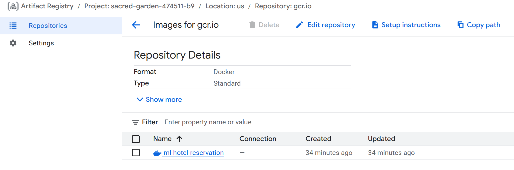

# 🚀 **CICD Pipeline — Deployment Automation Stage**

This branch implements a **Continuous Integration and Continuous Deployment (CICD)** workflow for the **MLOps Hotel Reservation Prediction** project.

It uses **Docker-in-Docker (DinD)** to automate testing, image creation, and cloud deployment — all triggered directly from your GitHub repository through **Jenkins**.

## 🗂️ **Updated Project Structure**

```
mlops-hotel-reservation-prediction/
├── artifacts/
├── config/
├── custom_jenkins/         # 🆕 Jenkins-in-Docker build context
│   └── Dockerfile          # 🆕 Custom Jenkins (DinD) image
├── src/
├── utils/
├── pipeline/
├── templates/
├── static/
├── img/
├── notebooks/
│   └── notebook.ipynb
├── app.py
├── Dockerfile              # 🆕 Project application Dockerfile (root)
├── Jenkinsfile             # 🆕 Pipeline definition (SCM → build → deploy)
├── requirements.txt
├── setup.py
└── README.md
```

## ⚙️ **Pipeline Overview**

This CICD pipeline comprises **7 stages**:

1. Setup Jenkins container
2. GitHub Integration
3. Dockerization of project
4. Create a venv in Jenkins
5. Build Docker image of project → Push image to **Google Cloud Registry (GCR)**
6. Extract image from GCR → Push to **Google Cloud Run** → App is deployed!
7. Cloud Project Clean-up

## 🧱 **Stage 1 — Setup Jenkins Container**

1. In the root directory, create a folder named `custom_jenkins/` and add a `Dockerfile` inside it.

2. In your terminal, navigate into this folder and build the Jenkins image:

   ```bash
   docker build -t jenkins-dind .
   ```

3. Check the image was created successfully:

   ```bash
   docker images
   ```

   Example output:

   ```
   REPOSITORY      TAG       IMAGE ID       CREATED          SIZE
   jenkins-dind    latest    0989b3f7353e   45 seconds ago   1.68GB
   ```

4. Run the container:

   ```bash
   docker run -d --name jenkins-dind ^
   --privileged ^
   -p 8080:8080 -p 50000:50000 ^
   -v //var/run/docker.sock:/var/run/docker.sock ^
   -v jenkins_home:/var/jenkins_home ^
   jenkins-dind
   ```

5. Check your running containers:

   ```bash
   docker ps
   ```

6. View logs to get the initial Jenkins setup password:

   ```bash
   docker logs jenkins-dind
   ```

   Example output:

   ```
   Jenkins initial setup is required. Please use the following password:
   a51213b410a2476e9ce9d98349e014b8
   ```

7. Open your browser at **[http://localhost:8080](http://localhost:8080)** and enter the password when prompted.

   

8. Continue through the setup screens:

   * Click **“Install suggested plugins”** 
   
      

   * Create your **admin user** 
   
      

   * Once complete, you’ll see your **Jenkins Dashboard** 
   
      

9. Install Python and other dependencies inside the Jenkins container:

   ```bash
   docker exec -u root -it jenkins-dind bash
   apt update -y
   apt install -y python3
   python3 --version
   ln -s /usr/bin/python3 /usr/bin/python
   python --version
   apt install -y python3-pip
   apt install -y python3-venv
   exit
   ```

10. Restart the container:

    ```bash
    docker restart jenkins-dind
    ```

11. Refresh your Jenkins dashboard and sign in again with your admin credentials. 

    

✅ **Stage 1 complete — Jenkins container successfully configured.**

## 🔗 **Stage 2 — GitHub Integration**

1. In your **GitHub account**, go to **Settings → Developer settings → Personal access tokens → Tokens (classic)**.

2. Click **“Generate new token (classic)”**.

   * Under “Note”, give it a clear name.
   * Under permissions, select **`admin:repo_hook`**. 
      
      

3. Copy your token. Then, in the **Jenkins dashboard**, go to:
   `Manage Jenkins → Credentials → (global) → + Add Credential`. 
   

4. Create a new Jenkins pipeline:

   * From the dashboard, click **+ New Item**
   * Enter a name
   * Select **Pipeline** as the type 
   
      

5. In the configuration screen:

   * Set **Definition** to **Pipeline script from SCM**
   * Enter your repo URL
   * Choose your saved credentials
   * Under **Branches to build**, set **Branch Specifier** to `*/main` 
   
      

6. Scroll down and click **Pipeline Syntax**.

   * Under *Sample Step*, select **“checkout: Check out from version control”**
   * Fill in your repo details and click **Generate Pipeline Script** 
   
      

7. Copy the generated script into your project’s `Jenkinsfile` (first stage only) and push to GitHub.

8. Back in Jenkins, open your pipeline and click **Build Now**.

9. After build completion, click the build number → **Workspace** → your project folder to verify the repo. 

    

✅ **Stage 2 complete — GitHub successfully integrated with Jenkins.**

## 🐳 **Stage 3 — Dockerization of Project**

In your project root directory, create a **Dockerfile** defining how your application should be containerised.

✅ **Stage 3 complete — Project dockerized.**

## 🧩 **Stage 4 — Create a Virtual Environment in Jenkins**

1. Update your `Jenkinsfile` with a stage to create a virtual environment.
2. Commit & push, then trigger another build.
3. Check Jenkins workspace to confirm that the `venv` exists.

✅ **Stage 4 complete — Virtual environment created in Jenkins.**

## 🏗️ **Stage 5 — Build Docker Image of Project & Push to GCR**

1. In VS Code, open a terminal and navigate to your `custom_jenkins/` folder.

2. Install **Google Cloud CLI** inside Jenkins:

   ```bash
   docker exec -u root -it jenkins-dind bash
   apt-get update
   apt-get install -y curl apt-transport-https ca-certificates gnupg
   curl https://packages.cloud.google.com/apt/doc/apt-key.gpg | apt-key add -
   echo "deb https://packages.cloud.google.com/apt cloud-sdk main" | tee -a /etc/apt/sources.list.d/google-cloud-sdk.list
   apt-get update && apt-get install -y google-cloud-sdk
   ```

3. Verify installation:

   ```bash
   gcloud --version
   ```

4. Grant Docker permissions:

   ```bash
   groupadd docker
   usermod -aG docker jenkins
   usermod -aG root jenkins
   exit
   ```

5. Restart the container:

   ```bash
   docker restart jenkins-dind
   ```

6. In Jenkins, add a **new credential**:

   * **Kind** → *Secret file*
   * Upload the **GCP service-account key JSON** 
   
     

7. In **GCP Console**, enable APIs:

   * **Google Container Registry API** 
   
      
   
   * **Artifact Registry API**
   * **Cloud Resource Manager API**
     Once enabled, the button changes to *Manage*:

      

8. Add **Owner** role to your service account: 

    

9. Retrieve your **Project ID**: 

    

10. Add this to your `Jenkinsfile`:

    ```groovy
    GCP_PROJECT = "your-project-id"
    ```

11. Create the stage **“Build and Push Docker Image to GCR”**, push to GitHub, and build.

12. After completion, check **Container Registry** → your project image should appear. 

    

✅ **Stage 5 complete — Docker image built and pushed to GCR.**

## ☁️ **Stage 6 — Deploy Image from GCR to Cloud Run**

1. Add a new stage **“Deploy to Google Cloud Run”** in your `Jenkinsfile`.

2. Commit & push, rebuild pipeline.

3. On success, you’ll see:

   ```
   Service URL: https://ml-hotel-reservation-104396989907.us-central1.run.app
   ```

4. View your running service in **Cloud Run → Services**: 

5. Click your container to view **metrics** (requests, latency, instances): 

✅ **Stage 6 complete — Application successfully deployed to Cloud Run.**

## 🧹 **Stage 7 — Cloud Project Clean-up**

1. Delete the **Cloud Run** service.
2. Remove images from **Container Registry**.
3. Optionally delete the **Cloud Storage** bucket.

✅ **Stage 7 complete — Resources released.**

## ✅ **Pipeline Summary**

| Stage | Description             | Outcome                          |
| :---: | ----------------------- | -------------------------------- |
|   1   | Setup Jenkins Container | Jenkins running in Docker (DinD) |
|   2   | GitHub Integration      | Jenkins connected to GitHub      |
|   3   | Dockerization           | Project Dockerfile created       |
|   4   | Create venv in Jenkins  | Python virtual environment setup |
|   5   | Build & Push to GCR     | Docker image stored in GCR       |
|   6   | Deploy to Cloud Run     | Application live via Service URL |
|   7   | Clean-up                | All resources deleted            |